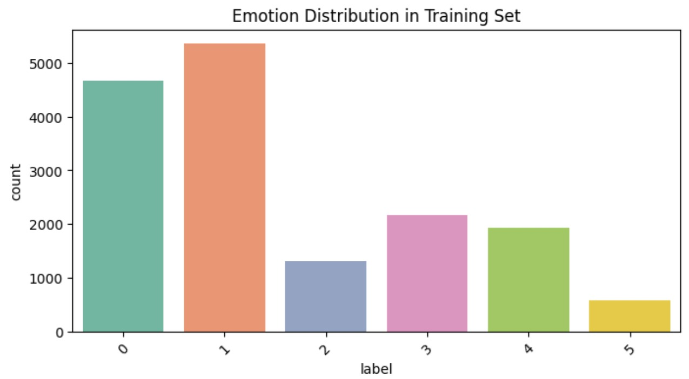
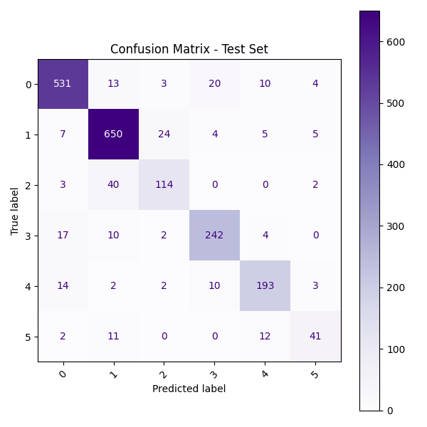

# Emoticon-Detecticon

A dataset of English Twitter messages with six basic emotions: anger, fear, joy, love, sadness, and surprise. For more detailed information please refer to the paper below.
The authors constructed a set of hashtags to collect a separate dataset of English tweets from the Twitter API belonging to eight basic emotions, including anger, anticipation, disgust, fear, joy, sadness, surprise, and trust. The data has already been preprocessed based on the approach described in their paper.

Homepage: https://github.com/dair-ai/emotion_dataset
Paper: CARER: Contextualized Affect Representations for Emotion Recognition

# An example of 'train' looks as follows.
{
   "label": 0,
   "text": "im feeling quite sad and sorry for myself but ill snap out of it soon"
}

### 📊 Emotion Distribution in Training Set

This bar chart shows the distribution of emotions in the training dataset.

## EVALUAATION METRICS 

| Metric           | Meaning                                                          |
| ---------------- | ---------------------------------------------------------------- |
| **Accuracy**     | Overall correct predictions:                            |
| **Precision**    | How many predicted emotions were correct                         |
| **Recall**       | How well the model finds all relevant cases for each emotion     |
| **F1-score**     | Harmonic mean of precision and recall → balance between them     |
| **Macro avg**    | Simple average across all emotions (treats all emotions equally) |
| **Weighted avg** | Accounts for how frequent each emotion appears                   |

### 🖼️ Example Confusion Matrix

### 📊 Observations:
- Classes 0 and 1 perform best (F1 > 0.90)
- Classes 2 and 5 show slightly lower recall
- Overall weighted F1-score ~ 0.89

## 🚀 How to Use

### ▶️ CLI Prediction (Already Implemented)

in bash:
cd app/
python cli_predict.py

Enter a sentence to detect its emotion:
> I miss my friends so much 😔

🧠 Predicted Emotion: SADNESS

